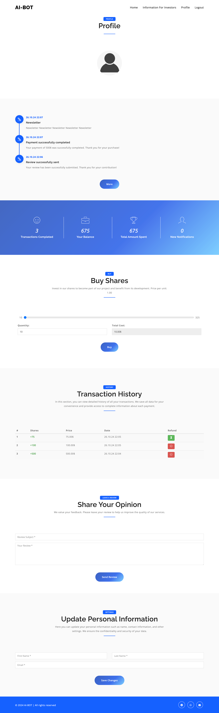

# Botify - Landing Blog for Stock Purchases

Botify is a landing blog platform where users can browse and purchase stocks. It combines a user-friendly interface with secure payment processing via Stripe.

## Installation and Setup

### Prerequisites
Ensure you have Python and Django installed.

```sh
pip install -r requirements.txt 
```

### Running the Project

1. Clone the repository or download the project files.
2. Navigate to the project directory.
3. Run database migrations:

```sh
python manage.py migrate
```

4. Start the development server:

```sh
python manage.py runserver
```

5. Open your browser and go to `http://127.0.0.1:8000/`.

## Technology Stack

- **Frontend:** JavaScript, jQuery, CSS, HTML, Bootstrap
- **Backend:** Python, Django
- **Payments:** Stripe


## Images: 

### signup 

### index 

### info 

### profile 

